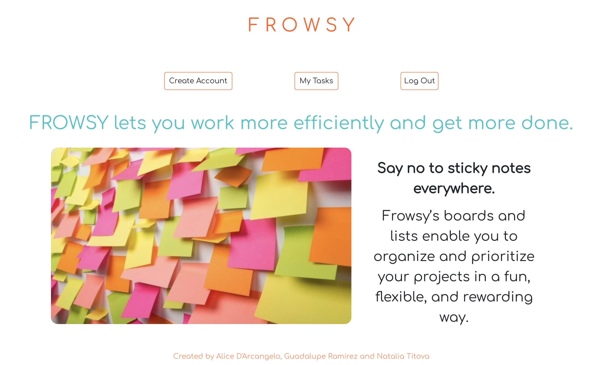

# FROWSY

## Link to Live Site:

### What is FROWSY?:

Frowsy is a task application that allows you to visually organize your to-do list by three categories: to-do, doing, and done.

### User Story:

As a user of Frowsy, We want the ability to create a new user, add tasks to our account, move them to different boards, edit them, and delete them so that we can use the site efficiently. End user goal: be able to navigate the site .Measurement of success: user can use site easily with no instructions.

### Problems Encountered:

1. Merging issues on Github
2. Issues with create routes for tasks
3. Solving issues with unknown limitations

### Technologies Used:

1. React
2. Express
3. BootStrap
4. React Router
5. React DND
6. Axios
7. MongoDB
8. Mongoose
9. Node.js

### Future Updates:

1. Editing User
2. Deleting User
3. Editing Board Names
4. Editing order of task appearance on the boards
5. Editing Number of Boards
6. Shared board capabilities
